# Optimizing Deep Learning Models for Accurate & Robust Medical Image Segmentation
**NIT Rourkela – Winter Internship (Dec 2024 – Feb 2025)**


> A clean, recruiter-friendly repository showcasing my medical image segmentation work completed during the Winter Internship at the **Department of Computer Science & Engineering, NIT Rourkela**.  
> The project focuses on robust training pipelines, clear evaluation (Dice/IoU), and reproducible visuals.


### Repo map
```
├─ med-seg.ipynb                        # main, reproducible notebook
├─ figures/                             # all plots auto-extracted from the notebook
├─ reports/                             # reports or artifacts (kept empty here)
├─ data/                                # (optional) small samples if you add them
├─ src/                                 # (optional) helper scripts later
└─ README.md

```
## At a glance

- **Objective:** Medical image segmentation with clear, reproducible evaluation.
- **Scope:** End-to-end workflow — preprocessing → training → inference → analysis — contained in `med-seg.ipynb`.
- **Repo contents:**  
  - Notebook: `med-seg.ipynb`  
  - Visuals: `figures/` (all plots saved from the notebook)  
  - Placeholders: `reports/`, `data/`, `src/`
- **Preprocessing:** resizing/normalization; basic mask checks (as implemented in the notebook).
- **Evaluation artifacts:** pixel-level confusion matrix, ROC (AUC), Precision-Recall (AP), Dice/IoU (per-image + aggregate), Dice/IoU vs threshold, coverage-vs-Dice, histograms/box-plots, and best/worst/random qualitative panels.
- **Environment:** standard scientific Python (Jupyter + NumPy/Pandas + Matplotlib; add/adjust libraries to match your notebook).

## Results Gallery

> Exported from `med-seg.ipynb` so reviewers can scan results without running the notebook.

<figure>
  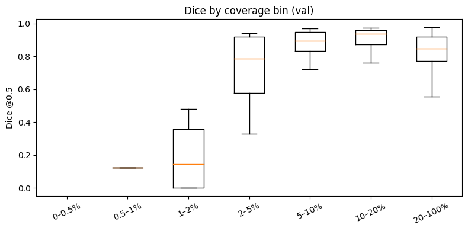
  <figcaption><b>Pixel-level confusion matrix (val)</b> — class balance and dominant error types.</figcaption>
</figure>

<figure>
  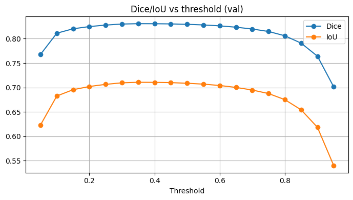
  <figcaption><b>ROC curve (val)</b> — threshold-free performance; AUC summarises separability.</figcaption>
</figure>

<figure>
  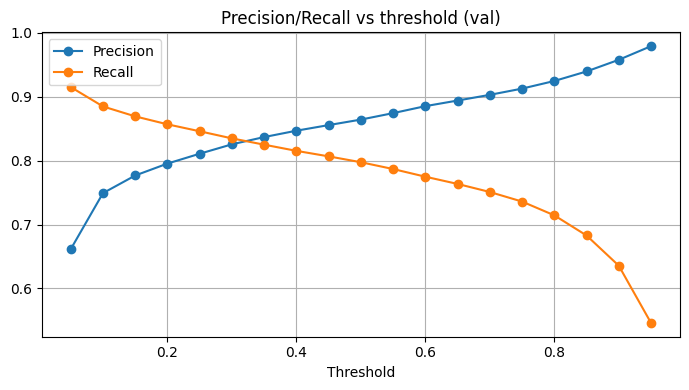
  <figcaption><b>Precision & Recall vs threshold (val)</b> — operating-point trade-off across 0→1.</figcaption>
</figure>

<figure>
  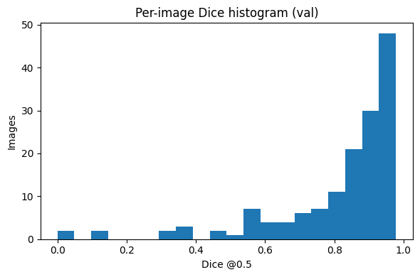
  <figcaption><b>Per-image Dice histogram (val)</b> — distribution of Dice across images.</figcaption>
</figure>

<figure>
  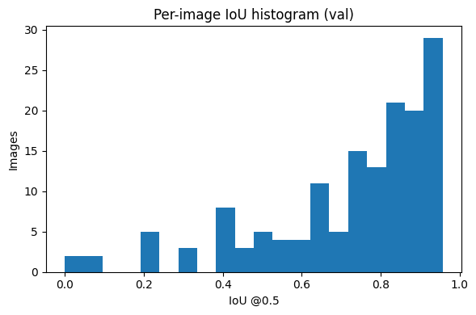
  <figcaption><b>Per-image IoU histogram (val)</b> — overlap quality across images.</figcaption>
</figure>

<figure>
  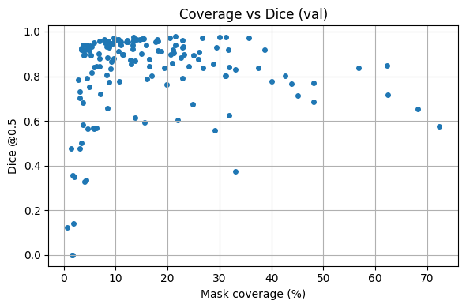
  <figcaption><b>Coverage vs Dice (val)</b> — relation between mask size (coverage %) and Dice.</figcaption>
</figure>

<figure>
  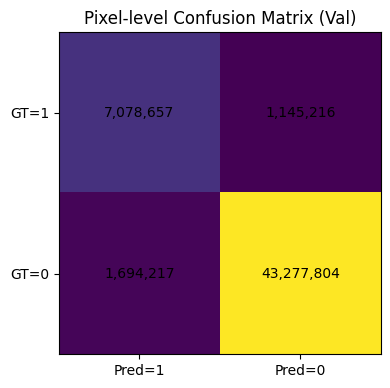
  <figcaption><b>Dice by coverage bin (val)</b> — box-plots summarising performance by mask size.</figcaption>
</figure>

<figure>
  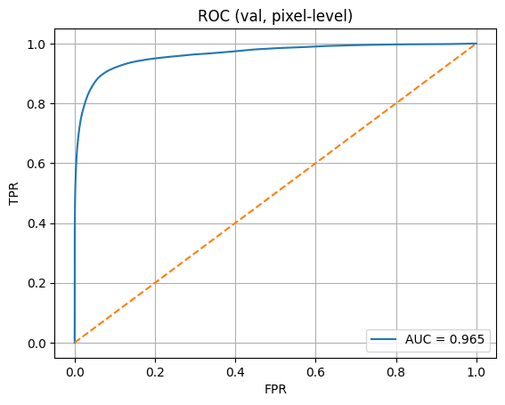
  <figcaption><b>Dice/IoU vs threshold (val)</b> — pick a stable operating point.</figcaption>
</figure>

<figure>
  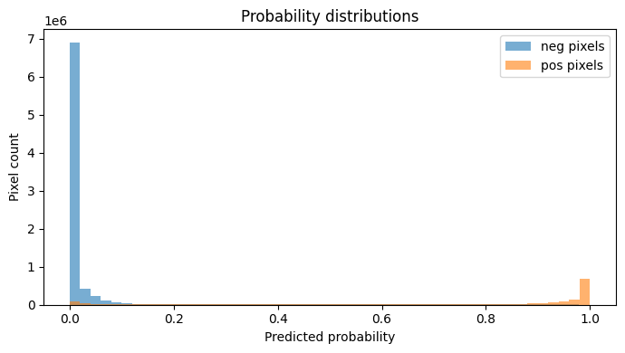
  <figcaption><b>Reliability diagram</b> — calibration check (ECE).</figcaption>
</figure>

<figure>
  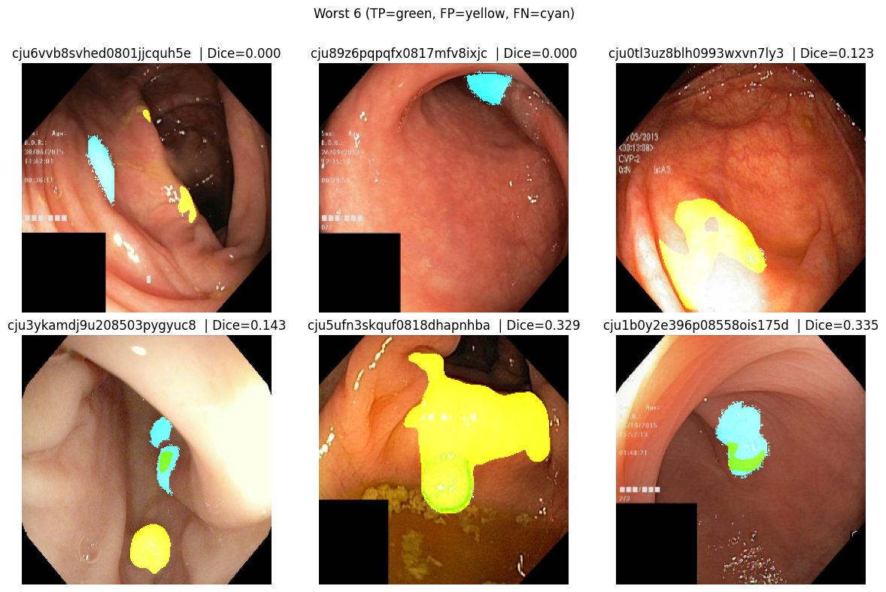
  <figcaption><b>Pixel probability distributions</b> — histograms for positive vs negative pixels.</figcaption>
</figure>

### Qualitative panels

<figure>
  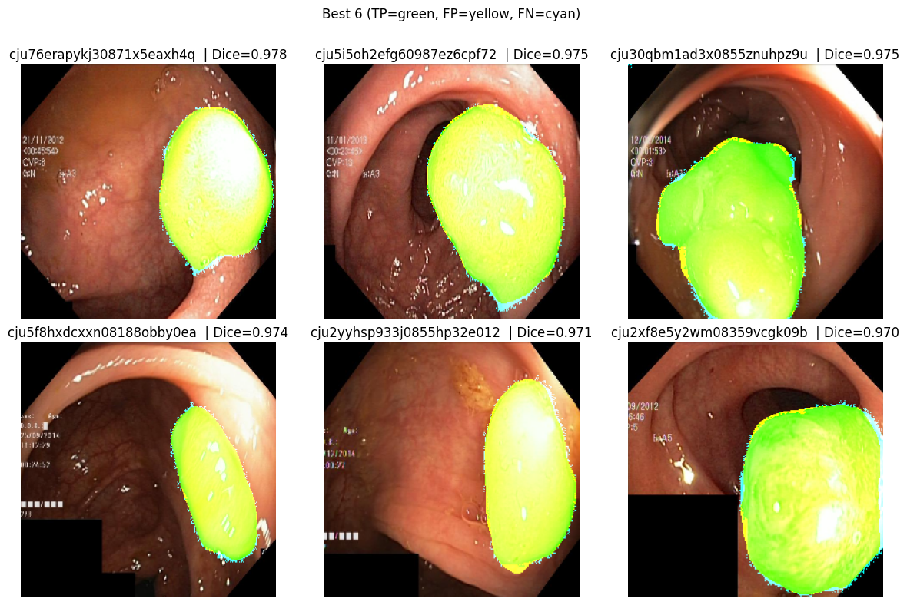
  <figcaption><b>Worst 6</b> — examples with low Dice; TP=green, FP=yellow, FN=cyan.</figcaption>
</figure>

<figure>
  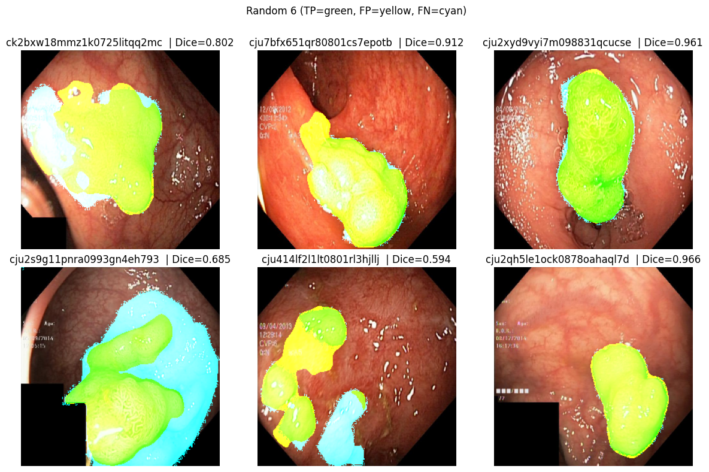
  <figcaption><b>Best 6</b> — high-quality segmentations with strong boundary agreement.</figcaption>
</figure>

<figure>
  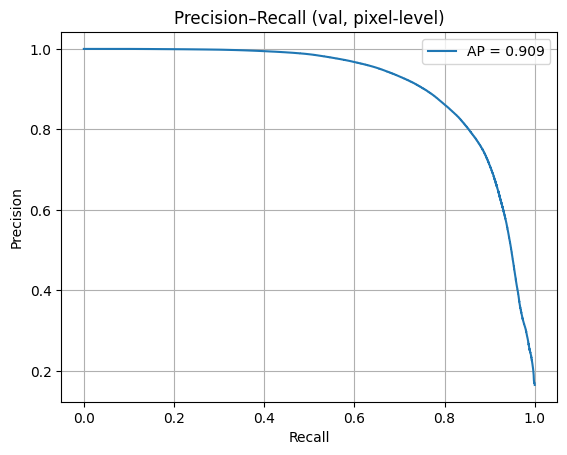
  <figcaption><b>Random 6</b> — unbiased samples for quick visual audit.</figcaption>
</figure>
