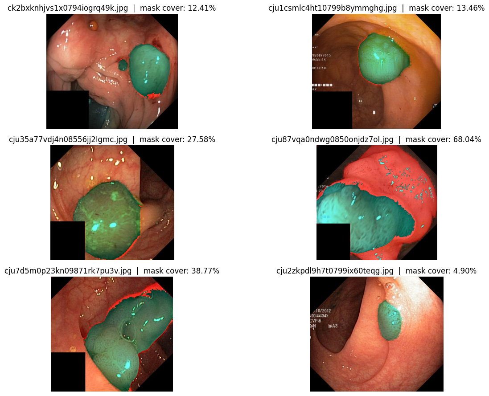

# Optimizing Deep Learning Models for Accurate & Robust Medical Image Segmentation
**NIT Rourkela – Winter Internship (Dec 2024 – Feb 2025)**

> A clean, recruiter-friendly project showcasing medical image segmentation experiments, results, and visuals from my internship at the Department of Computer Science & Engineering, NIT Rourkela.

---

## 🔎 What this repo contains
- **`med-seg.ipynb`** — the full, reproducible notebook.
- **`figures/`** — all plots & visualizations auto-extracted from the notebook.
- **`reports/nit-rourkela-internship-certificate.png`** — internship certificate.
- **`data/`** — (optional) place small sample data here.
- **`src/`** — (optional) helper scripts if you split code from the notebook.

